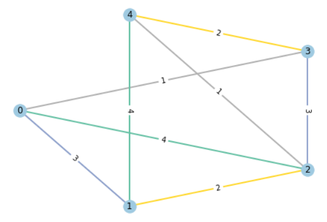

# Misra-Gries edge coloring

An implementation of ["Misra & Gries edge coloring algorithm"](https://www.cs.utexas.edu/users/misra/psp.dir/vizing.pdf) in python ~~and networkX~~.

#### How to use
* Please use [pypy3](https://www.pypy.org/) to run the code as I've tuned it with JIT in mind. With cpython, the code runs miserably slow (up to 10 times slower).

* **Input**: On the first line, type `|V|` and `|E|`. Then, for each line, type in the edges by the index of their end-point vertices. Vertex indices must be 0-based.

* **Output**: For the first line, the max degree of the graph (`Δ`) and max number of colors used (`ᵪ′`) is printed. For each next line, the first two integer represent the end-points of an edge in the input graph, and the third integer indicates its color.

Have a look at examples at [generated testcases](https://codeberg.org/alifara/Misra-Gries-coloring/src/branch/master/generated%20testcases) folder.

##### For example


```sh
$ pypy3 main.py
5 8
0 1
0 2
0 3
1 2
1 4
2 3
2 4
3 4

4 4
0 1 3
0 2 4
0 3 1
1 2 2
1 4 4
2 3 3
2 4 1
3 4 2
```




### Performance
With a `K`<sub>`50`</sub> as input, on a Ryzen 7 laptop CPU: `425.8 ms ±  15.9 ms`

``` shell
$ hyperfine --warmup 10 --runs 100 -i "pypy3 main.py < 'generated testcases/input_k50.txt'"
Benchmark #1: pypy3 main.py < 'generated testcases/input_k50.txt'
  Time (mean ± σ):     425.8 ms ±  15.9 ms    [User: 396.4 ms, System: 23.3 ms]
  Range (min … max):   402.6 ms … 467.4 ms    100 runs
```

### Jupyter Notebook View

* [jupyter notebook/visual_implementation.ipynb](https://nbviewer.jupyter.org/urls/codeberg.org/alifara/Misra-Gries-coloring/raw/branch/master/jupyter%20notebook/visual_implementation.ipynb) (It also contains visualizations I did in order to better understand and implement the algorithm.)
